  

  

   

  
  
  

    
  ✦ CITY OF STARS · 👾 <i>Entre circuitos, clusters e cidades acesas à noite.</i> 👾 · CITY OF STARS ✦

 

  <code>✦ ─────── ✧ ─────── ⭐ ─────── ✧ ─────── ✦</code>

## ❄️ ATO I — INVERNO

  

Antes de trabalhar com plataformas, comecei perto da camada física: circuitos, sensores, firmware e protocolos que precisam sobreviver ao mundo real.

Minha base em **Eletroeletrônica**, seguida pela formação em **Análise e Desenvolvimento de Sistemas** e Técnico em Desenvolvimento de Sistemas pelo **SENAI**, me levou por ESP32, Arduino, C++, MQTT, HTTP, LoRa e CAN.

Foi ali que aprendi a olhar para detalhes, telemetria e falhas sem glamour — porque um sistema embarcado não aceita “na minha máquina funcionou”.

   
  <code>⭐ · ✦ · ⭐ · ✦ · ⭐ · ✦ · ⭐</code>

## 🌸 ATO II — PRIMAVERA

  

A transição para DevOps aconteceu quando percebi que os mesmos princípios de confiabilidade valiam para algo maior: não apenas um dispositivo, mas toda a plataforma ao redor dele.

Hoje sou **Analista DevOps Júnior na CSD BR**, desde fevereiro de 2026. Meu foco é deixar a operação mais clara: deploys repetíveis, segredos no lugar certo, clusters observáveis e menos espaço para improviso.

   
  <code>✦ ─── uma nova estação começa quando a infraestrutura deixa de ser ruído ─── ✦</code>

## ☀️ ATO III — VERÃO

  

### ☁️ Cloud

### 📦 Containers & Orquestração

### 🔁 CI/CD & GitOps

### 📡 Observabilidade

### 🗄️ Dados & Infraestrutura Distribuída

### 🐧 Sistema

### 🔌 Raízes embarcadas

   
  <code>☀️ ✦ cloud, código, sinais e observabilidade ✦ ☀️</code>

## 🍂 ATO IV — OUTONO

  

### 🔐 Sealed Secrets → External Secrets Operator

O gerenciamento de segredos precisava deixar de ser uma preocupação espalhada entre manifestos e ganhar uma fonte de verdade adequada ao ambiente.

Liderei a migração de **Sealed Secrets** para **External Secrets Operator (ESO)**, usando o **AWS Secrets Manager** como backend e levando o novo padrão para todos os ambientes: **dev, QA e HML**.

- Segredos desacoplados dos manifestos versionados.
- Gestão centralizada e mais flexível das credenciais.
- Fluxo alinhado ao modelo GitOps.
- Base mais limpa para rotação, manutenção e evolução dos ambientes.

### 🛠️ Gerenciamento de nodes Cassandra

Nos ambientes de QA para baixo, a manutenção de Cassandra não pode depender de lembrete, planilha ou intervenção manual toda vez que algo precisa acontecer.

Por isso, lidero uma ferramenta própria para gerenciar nodes Cassandra, com **agendamento automatizado de repairs**, monitoramento dos clusters e o **Cassandra Reaper** operando por trás da aplicação.

- Rotinas recorrentes tratadas como processo, não como tarefa avulsa.
- Mais visibilidade sobre o estado dos clusters.
- Operação mais previsível nos ambientes não produtivos.
- Menos atrito para quem cuida da plataforma no dia a dia.

   
  <code>🍂 ✦ pipelines rodando, clusters observados, cidade acesa ✦ 🍂</code>

## 🌌 INTERLÚDIO — GitHub Analytics

  
  

  

  <code>✦ ─────── ✧ ─────── ⭐ ─────── ✧ ─────── ✦</code>

## 📬 CRÉDITOS FINAIS

  
  

 

  

    

  

    

  <code>✦ ✧ ⭐ ✧ ✦ &nbsp; fim de jornada sob um céu cheio de próximos passos &nbsp; ✦ ✧ ⭐ ✧ ✦</code>

    

  

